# Creating Client ID and Secret for Google Drive API v3

In order to access Google Drive API v3, you need to create OAuth 2.0 credentials, which include a client ID and secret. Follow these steps to obtain your credentials:

## 1. Set Up a Project in Google Cloud Console

1. Go to the [Google Cloud Console](https://console.cloud.google.com/).
2. Click the project drop-down and select or create the project you want to use for the Google Drive API.

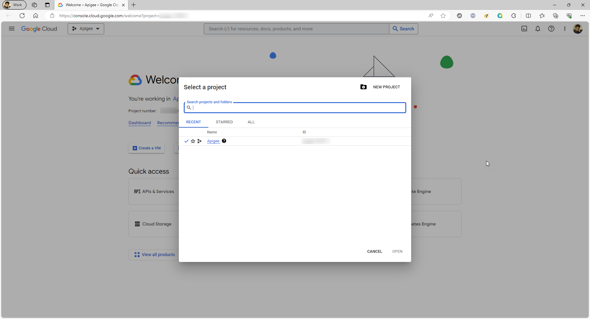

## 2. Enable the Google Drive API

1. In the Google Cloud Console, navigate to "APIs & Services" > "Library."
2. Search for "Google Drive API" and select it.
3. Click the "Enable" button to enable the API for your project.

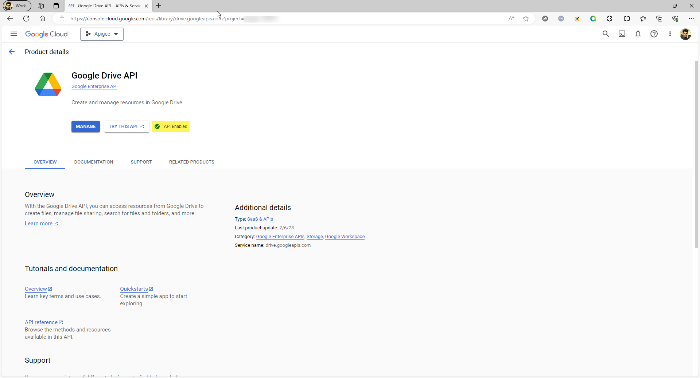

## 3. Create OAuth 2.0 Credentials

1. In the Google Cloud Console, navigate to "APIs & Services" > "Credentials."
2. Click the "Create Credentials" dropdown and select "OAuth client ID."

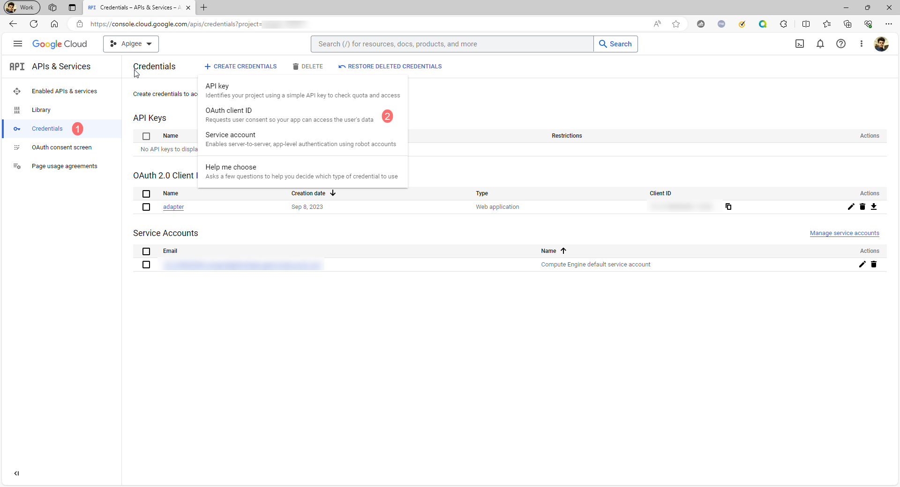

3. Choose "Web application" as the application type.

## 4. Configure the OAuth Consent Screen

1. Click "Configure consent screen."
2. Fill in the required fields such as "App Name" and "User Support Email."
3. Add the authorized domains for your application.

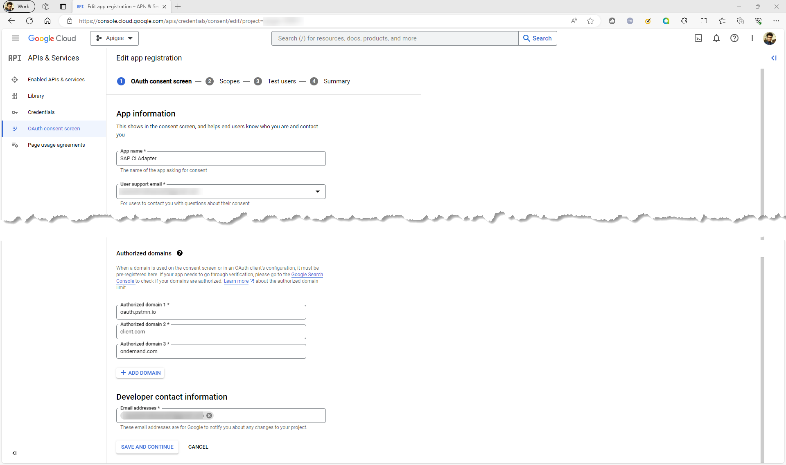

4. Add the scope for your application.

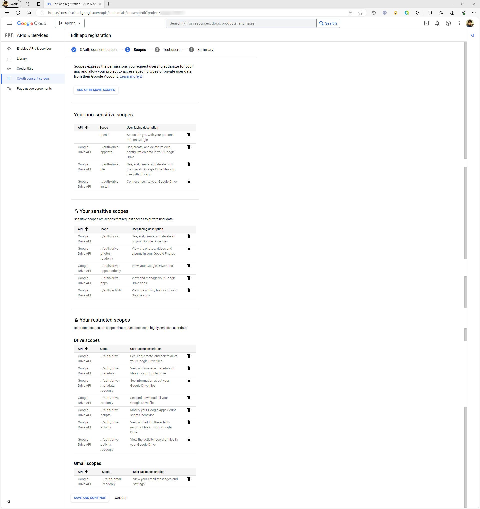

## 5. Create OAuth Client ID

1. After configuring the consent screen, you will be redirected to the OAuth client creation form.
2. Enter a name for your OAuth client.
3. Under "Authorized redirect URIs," add the redirect URLs where users will be redirected after granting permission (e.g., `https://client.com/callback` and `https://<cf-domain>.integrationsuite.cfapps.jp10.hana.ondemand.com/itspaces/odata/api/v1/OAuthTokenFromCode`).
4. Click "Create" to create your OAuth client.
5. Your client ID and secret will be displayed. Save them securely.

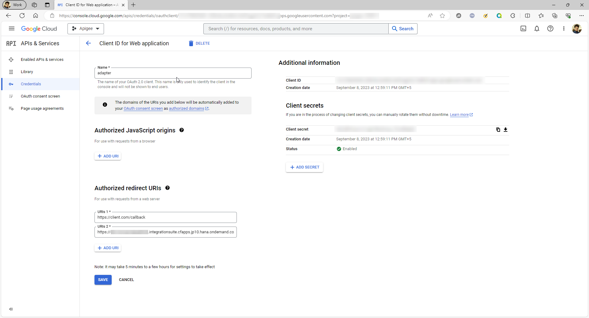

## 6. Download Credentials JSON

1. Click the download icon next to your OAuth client ID to download the credentials JSON file.
2. Keep this file secure, as it contains sensitive information.

## 7. Create Security Material

1. Navigate to Security material tiles in the Monitoring Overview page.
2. Create an Oauth2 Authorization Code artifact.

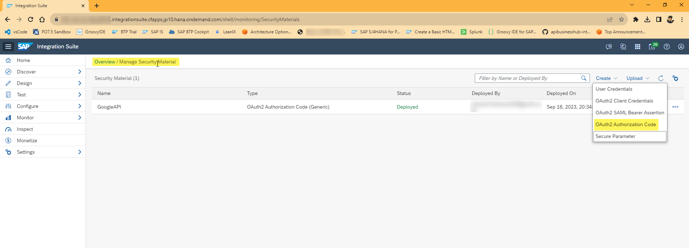

2. Enter a name and description for your artifact.
3. Choose Provider as Generic.
4. Under Authorization URL and Token Service URL add `https://accounts.google.com/o/oauth2/auth?access_type=offline&approval_prompt=force` and `https://oauth2.googleapis.com/token` respectively.
5. Copy client ID and secret from the JSON downloaded in section 6.
6. Select Send As Body Parameter radio button.
7. Add `https://www.googleapis.com/auth/drive` in the Scope input box.
8. Click on Deploy button.

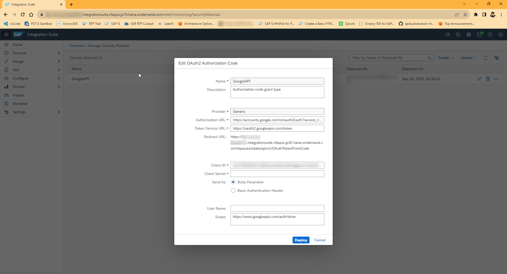

## 8. Authorize Security Material

1. Click on Authorize button.

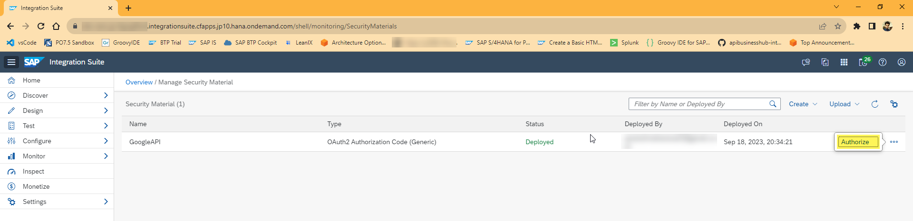

2. New tab will open with Google sign in page. Login with the user added in section 4.

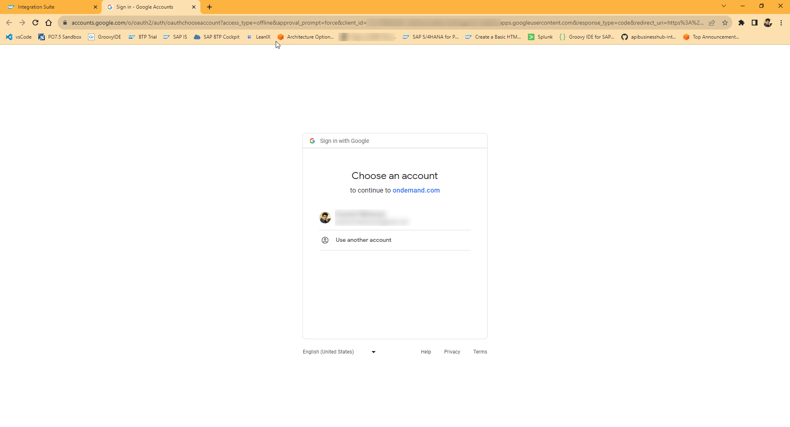

3. If your consent app is still in testing then you might get the below screen. Click on continue to proceed.

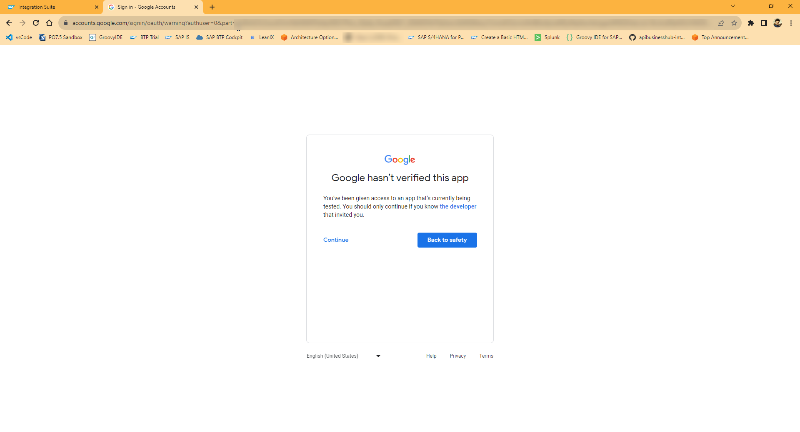

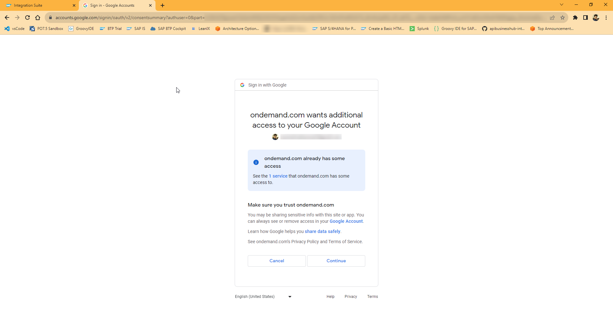

4. You will be redirected to this page. Please note you should receive below response otherwise the security material is not setup correctly. `<response>Authorization was successful: Refresh Token was added to the OAuth2 Authorization Code Credential 'GoogleAPI'.</response>`

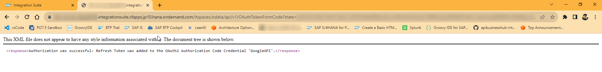

Now you have successfully created OAuth 2.0 credentials (client ID and secret) for the Google Drive. You can use this security material in your iFlow to authenticate and access Google Drive resources.

Make sure to handle your credentials securely and never expose them in publicly accessible code or repositories.
