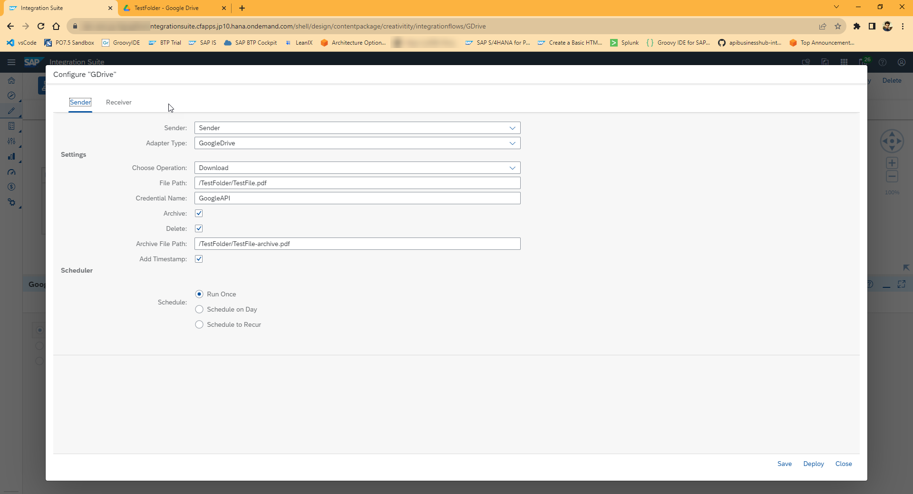
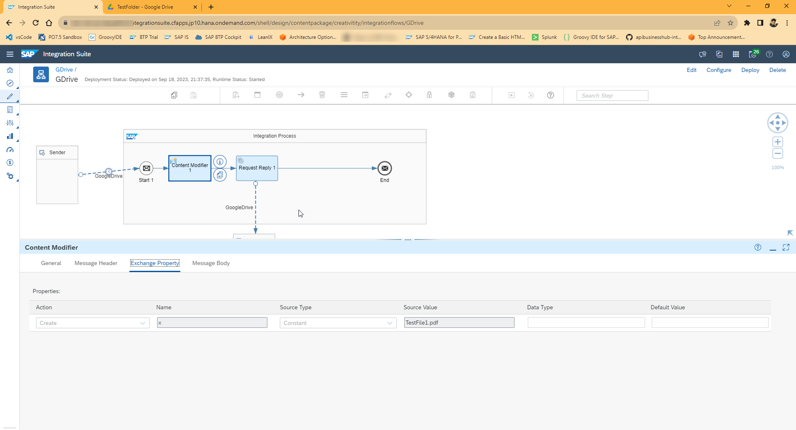
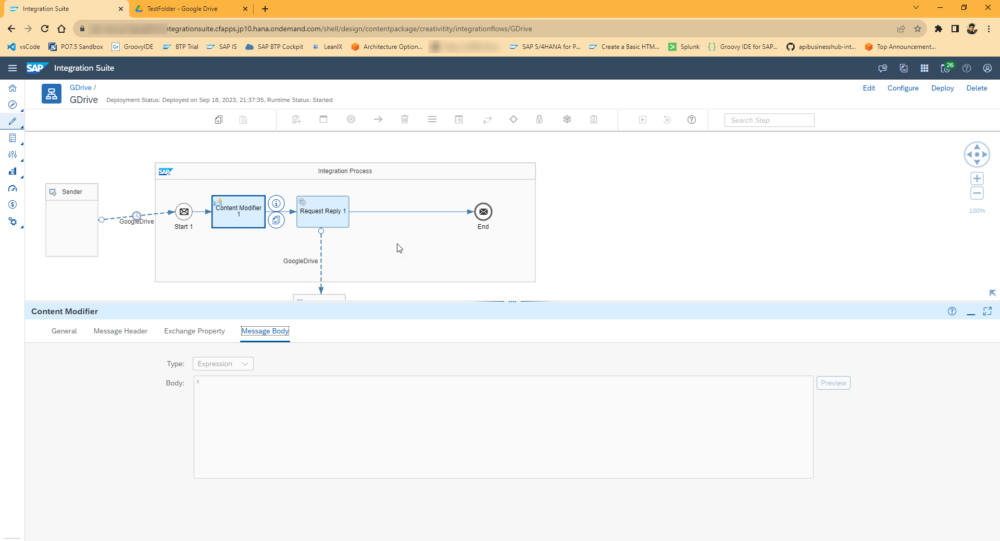
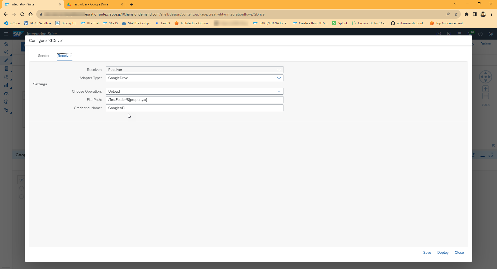
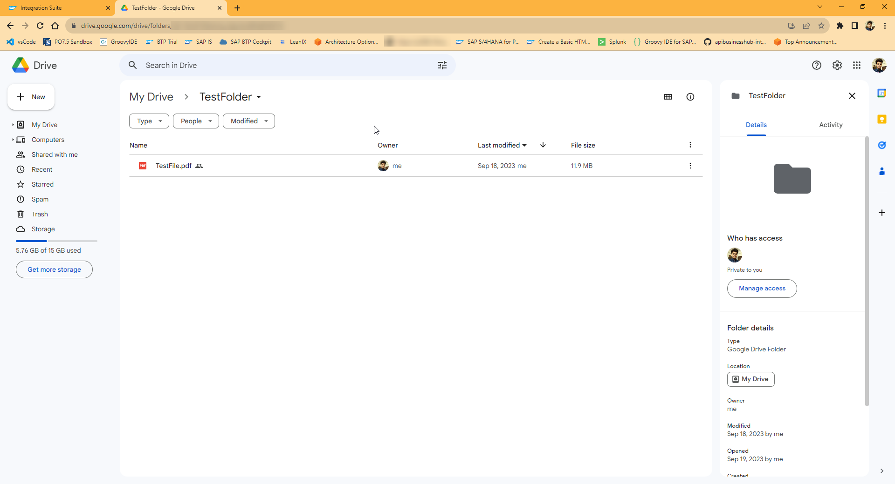
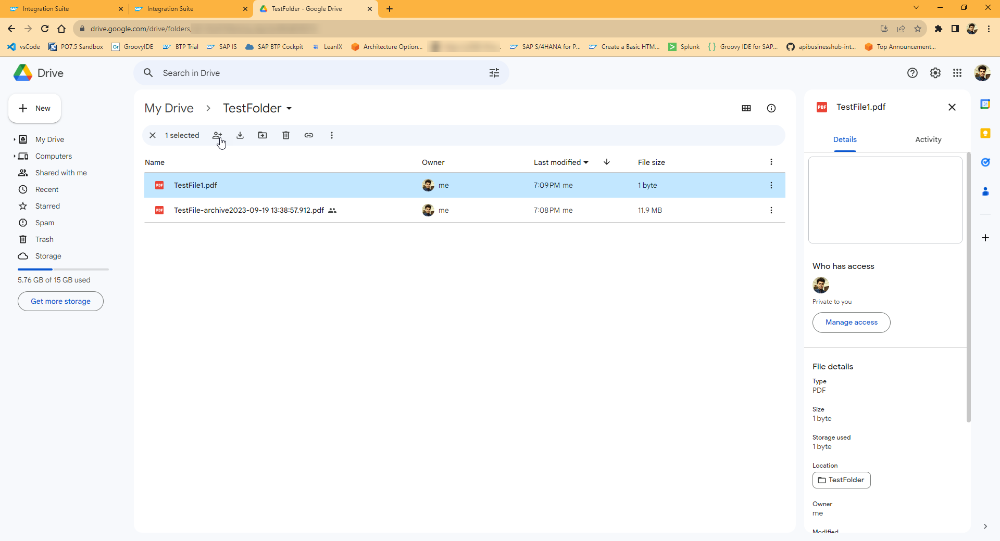
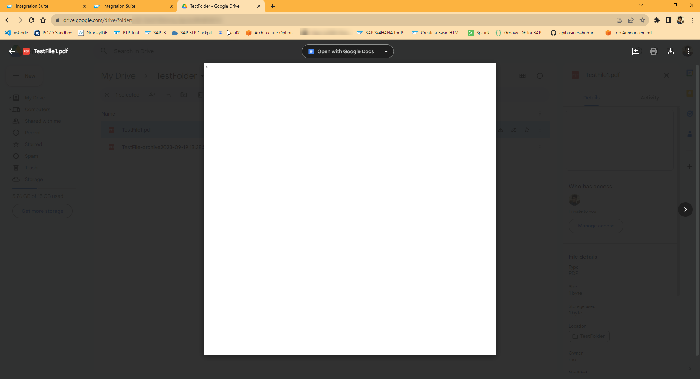

# Google Drive Adapter Test

## Overview

We will run the iFlow in different configuration and observe the results.

## Configuration:

### Sender Adapter
The sender adapter is configured to download the file and scheduled to run once. The Archive, Delete and Add Timestamp is also added.

### Content Modifier

A content modifier is added to define the file name as a property and assign a string "x" as the body to be uploaded by the receiver adapter.

### Receiver Adapter

The receiver adapter is configured to upload the file to google drive with **simple camel expression in the file path**.

## Result

### Expected Result

The iFlow run will Download the `TestFile.pdf` file from `TestFolder` and archive the same with added timestamp in `TestFolder`. This will also upload a file named as `TestFile1.pdf` in `TestFolder` as per the file path configuration `/TestFolder/${property.x}`. 

### Before Deployment

There is only one file named `TestFile.pdf` in `TestFolder`.

### Result

There are 2 files in the `TestFolder`.

`TestFile1.pdf` contain "x" which was configured in the content modifier body.

## Conclusion
Currently, the adapter is able to execute the above tasks.
